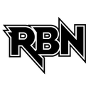
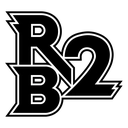
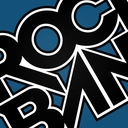
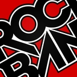
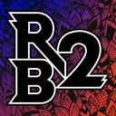
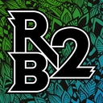
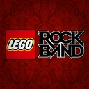
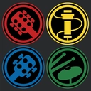
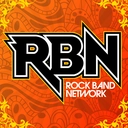

- [Folder Contents](#folder-contents)
- [Vector Folder: Contents](#vector-folder-contents)
  - [All Instrument Icons (Inline)](#all-instrument-icons-inline)
  - [Instrument Icons](#instrument-icons)
  - [Rock Band Logo (Compact)](#rock-band-logo-compact)
  - [Rock Band Logo (Inline)](#rock-band-logo-inline)
  - [Rock Band Logo (Mini)](#rock-band-logo-mini)
  - [Rock Band 4 Stars](#rock-band-4-stars)
  - [Super Instruments Power-Ups](#super-instruments-power-ups)
- [Icons Folder: Contents](#icons-folder-contents)
  - [Rock Band](#rock-band)
  - [Rock Band 2](#rock-band-2)
  - [Rock Band 3](#rock-band-3)
  - [LEGO Rock Band](#lego-rock-band)
  - [Rock Band Network](#rock-band-network)

# Folder Contents

- `png` - Icons in high definifion PNG format, with their sizes based on its Illustrator file artwork size.
- `thumbnail` - Icons thumbnail in WEBP format used on this README file to save bandwidth.
- `vectors` - Folder with the original Adobe Illustrator files.
- `vectors-icons` - Specific folder with the original Adobe Illustrator files of game icons used on official Xbox 360 packages.

# Vector Folder: Contents

## All Instrument Icons (Inline)

Inline versions of the instrument icons, including different instrument positions based on each media.

| IMAGE                                                          | FILE NAME                         | SIZE     | DESCRIPTION                                                                              |
| -------------------------------------------------------------- | --------------------------------- | -------- | ---------------------------------------------------------------------------------------- |
|  | all-instrument-icons-inline-rbtp1 | 1300x300 | Icon order from RB Track Pack Vol. 1                                                     |
|  | all-instrument-icons-inline-rbtp2 | 1300x300 | Icon order from RB2, RB Track Pack Vol. 2, Metal Pack, Country Pack, Rock Band iOS, etc. |
|    | all-instrument-icons-inline-rb3   | 1300x300 | Icon order from RB3                                                                      |

## Instrument Icons

The instrument icons used on the main franchise.

| IMAGE                                                   | FILE NAME                  | SIZE      | DESCRIPTION           |
| ------------------------------------------------------- | -------------------------- | --------- | --------------------- |
|       | instrument-icons-band      | 1700x1700 | Band icon             |
|       | instrument-icons-bass      | 1700x1700 | Bass icon             |
|      | instrument-icons-drums     | 1700x1700 | Drums icon            |
|     | instrument-icons-guitar    | 1700x1700 | Guitar icon           |
|      | instrument-icons-harm2     | 1700x1700 | 2-Part Harmonies icon |
|      | instrument-icons-harm3     | 1700x1700 | 3-Part Harmonies icon |
|       | instrument-icons-keys      | 1700x1700 | Keys icon             |
|    | instrument-icons-probass   | 1700x1700 | PRO Bass icon         |
|   | instrument-icons-prodrums  | 1700x1700 | PRO Drums icon        |
|  | instrument-icons-proguitar | 1700x1700 | PRO Guitar icon       |
|    | instrument-icons-prokeys   | 1700x1700 | PRO Keys icon         |
|     | instrument-icons-vocals    | 1700x1700 | Solo Vocals icon      |

## Rock Band Logo (Compact)

Compact version of the Rock Band logo for all main titles.

| IMAGE                                            | FILE NAME           | SIZE      | DESCRIPTION                     |
| ------------------------------------------------ | ------------------- | --------- | ------------------------------- |
|  | rb-logo-compact-rb1 | 1500x1500 | Rock Band Logo: Compact         |
|  | rb-logo-compact-rb2 | 1500x1500 | Rock Band 2 Logo: Compact       |
|  | rb-logo-compact-rb3 | 1500x1500 | Rock Band 3 Logo: Compact       |
|  | rb-logo-compact-rb4 | 1500x1500 | Rock Band 4 Logo: Compact       |
|  | rb-logo-compact-rbn | 1500x1500 | Rock Band Network Logo: Compact |

## Rock Band Logo (Inline)

Inline version of the Rock Band logo for all main titles.

| IMAGE                                           | FILE NAME          | SIZE     | DESCRIPTION              |
| ----------------------------------------------- | ------------------ | -------- | ------------------------ |
|  | rb-logo-inline-rb1 | 2000x600 | Rock Band Logo: Inline   |
|  | rb-logo-inline-rb2 | 2000x600 | Rock Band 2 Logo: Inline |
|  | rb-logo-inline-rb3 | 2000x600 | Rock Band 3 Logo: Inline |
|  | rb-logo-inline-rb4 | 2000x600 | Rock Band 4 Logo: Inline |

## Rock Band Logo (Mini)

Mini version of the Rock Band 2 and 3 logo.

| IMAGE                                         | FILE NAME        | SIZE      | DESCRIPTION            |
| --------------------------------------------- | ---------------- | --------- | ---------------------- |
|  | rb-logo-mini-rb2 | 1500x1500 | Rock Band 2 Logo: Mini |
|  | rb-logo-mini-rb3 | 1500x1500 | Rock Band 3 Logo: Mini |

## Rock Band 4 Stars

Stars icons used on Rock Band 4.

| IMAGE                                          | FILE NAME         | SIZE      | DESCRIPTION        |
| ---------------------------------------------- | ----------------- | --------- | ------------------ |
|  | rb4-stars-default | 2000x2000 | Default star       |
|     | rb4-stars-gold    | 2000x2000 | Gold star          |
|      | rb4-stars-off     | 2000x2000 | Default star (off) |

## Super Instruments Power-Ups

Instrument icons with a special gradient, used on Rock Band Blitz on Super Instrument power-ups.

| IMAGE                                                 | FILE NAME                | SIZE      | DESCRIPTION      |
| ----------------------------------------------------- | ------------------------ | --------- | ---------------- |
|    | super-instruments-bass   | 1500x1500 | Bass icon        |
|   | super-instruments-drums  | 1500x1500 | Drums icon       |
|  | super-instruments-guitar | 1500x1500 | Guitar icon      |
|    | super-instruments-keys   | 1500x1500 | Keys icon        |
|  | super-instruments-vocals | 1500x1500 | Solo Vocals icon |

# Icons Folder: Contents

## Rock Band

|  |    |  |
| ------------------------------------- | ------------------------------------------- | ------------------------------------------- |
| icon-rb1.png                          | icon-rb1-red.png                          | icon-rb1-frame.png                          |

## Rock Band 2

|  |  |
| ------------------------------------- | --------------------------------------- |
| icon-rb2.png                          | icon-rb2-2.png                          |

## Rock Band 3

|  |  |  |  |
| ------------------------------------- | ------------------------------------------ | ------------------------------------------------- | ------------------------------------------- |
| icon-rb3.png                          | icon-rb3-lime.png                          | icon-rb3-darkscarlet.png                          | icon-rb3-frame.png                          |

## LEGO Rock Band

|  |  |
| -------------------------------------- | -------------------------------------------------- |
| icon-lego.png                          | icon-lego-instr-icons.png                          |

## Rock Band Network

|  |
| ------------------------------------- |
| icon-rbn.png                          |
