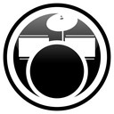

- [Folder Contents](#folder-contents)
- [Vector File Contents](#vector-file-contents)
  - [`all-instruments-icons-inline.ai`](#all-instruments-icons-inlineai)
  - [`rb-logo-compact.ai`](#rb-logo-compactai)
  - [`rb-logo-inline.ai`](#rb-logo-inlineai)
  - [`rb4-stars.ai`](#rb4-starsai)
  - [`super-instruments.ai`](#super-instrumentsai)

# Folder Contents

- `png` - Icons in high definifion PNG format, with their sizes based on its Illustrator file artwork size.
- `thumbnail` - Icons thumbnail in WEBP format used on this README file to save bandwidth.
- `vectors` - Folder with the original Adobe Illustrator files.

# Vector File Contents

## `all-instruments-icons-inline.ai`

This file contains inline versions of the instrument icons, including different instrument positions based on each media.

| IMAGE                                                          | FILE NAME                         | SIZE     | DESCRIPTION                                                                              |
|----------------------------------------------------------------|-----------------------------------|----------|------------------------------------------------------------------------------------------|
|  | all-instrument-icons-inline-rbtp1 | 1300x300 | Icon order from RB Track Pack Vol. 1                                                     |
|  | all-instrument-icons-inline-rbtp2 | 1300x300 | Icon order from RB2, RB Track Pack Vol. 2, Metal Pack, Country Pack, Rock Band iOS, etc. |
|    | all-instrument-icons-inline-rb3   | 1300x300 | Icon order from RB3                                                                      |

## `rb-logo-compact.ai`

This file contains the compact version of the Rock Band logo for all main titles.

| IMAGE                                            | FILE NAME           | SIZE      | DESCRIPTION |
|--------------------------------------------------|---------------------|-----------|-------------|
|  | rb-logo-compact-rb1 | 1500x1500 | Rock Band   |
|  | rb-logo-compact-rb2 | 1500x1500 | Rock Band 2 |
|  | rb-logo-compact-rb3 | 1500x1500 | Rock Band 3 |
|  | rb-logo-compact-rb4 | 1500x1500 | Rock Band 4 |

## `rb-logo-inline.ai`

This file contains the inline version of the Rock Band logo for all main titles.

| IMAGE                                           | FILE NAME          | SIZE     | DESCRIPTION              |
|-------------------------------------------------|--------------------|----------|--------------------------|
|  | rb-logo-inline-rb1 | 2000x600 | Rock Band Logo: Inline   |
|  | rb-logo-inline-rb2 | 2000x600 | Rock Band 2 Logo: Inline |
|  | rb-logo-inline-rb3 | 2000x600 | Rock Band 3 Logo: Inline |
|  | rb-logo-inline-rb4 | 2000x600 | Rock Band 4 Logo: Inline |

## `rb4-stars.ai`

This file contains stars icons used on Rock Band 4.

| IMAGE                                          | FILE NAME         | SIZE      | DESCRIPTION        |
|------------------------------------------------|-------------------|-----------|--------------------|
|  | rb4-stars-default | 2000x2000 | Default star       |
|     | rb4-stars-gold    | 2000x2000 | Gold star          |
|      | rb4-stars-off     | 2000x2000 | Default star (off) |

## `super-instruments.ai`

This file contains instrument icons with a special gradient, used on Rock Band Blitz on Super Instrument power-ups.

| IMAGE                                                 | FILE NAME                | SIZE      | DESCRIPTION      |
|-------------------------------------------------------|--------------------------|-----------|------------------|
|    | super-instruments-bass   | 1500x1500 | Bass icon        |
|   | super-instruments-drums  | 1500x1500 | Drums icon       |
|  | super-instruments-guitar | 1500x1500 | Guitar icon      |
|    | super-instruments-keys   | 1500x1500 | Keys icon        |
|  | super-instruments-vocals | 1500x1500 | Solo Vocals icon |