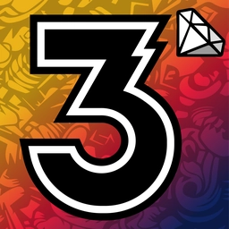
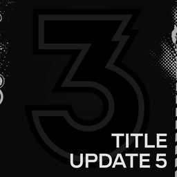

# Vector Icons

 

# Instrument Icons

 

# Rockshelf

 

# Disclaimer

This is a free-to-use recreations of artworks from the Rock Band franchise. All respective ROCK BAND logos and assets copyrights belongs to each respective owners.
